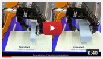

# Learning From Demonstration Experiments

This is the top package to test virtual springs and DMPs. It uses all other packages and contains ad-hoc programs. It contains the experiment procedure described in the paper:

* G. Solak and L. Jamone. Learning by demonstration and robust control of dexterous in-hand robotic manipulation skills. In IEEE/RSJ International Conference on Intelligent Robots and Systems. IEEE, 2019.

[](http://www.youtube.com/watch?v=BsC-uR-y08Q)

**Warning:** *This package is not intended for general use. It contains ad-hoc code for experiments presented in the above paper. It may serve as example code, but running it directly on a different robot setup may be unsafe.*

## Install
*Tested on Ubuntu 16.04, ROS-Kinetic*

- [Install ROS](http://wiki.ros.org/kinetic/Installation) & [create a catkin workspace](http://wiki.ros.org/catkin/Tutorials/create_a_workspace)
- Install [*allegro-hand-ros (experimental branch)*](https://github.com/gokhansolak/allegro-hand-ros/tree/experimental), [*dmp_tools*](https://github.com/ARQ-CRISP/ros_dmp_tools) and [*optoforce_publisher*](https://github.com/ARQ-CRISP/optoforce_publisher) according to their READMEs.
- Clone [*kdl_control_tools*](https://github.com/ARQ-CRISP/kdl_control_tools), [*spring_framework*](https://github.com/ARQ-CRISP/spring_framework), [*arq_ur5*](https://github.com/ARQ-CRISP/arq_ur5), [*allegro_hand_kdl*](https://github.com/ARQ-CRISP/allegro_hand_kdl), [*topic_connector*](https://github.com/ARQ-CRISP/ros_topic_connector), [*ur5_allegro_moveit*](https://github.com/ARQ-CRISP/ur5_allegro_moveit) into `your-catkin-workspace/src` directory:
  ```
  git clone git@github.com:ARQ-CRISP/kdl_control_tools.git
  git clone git@github.com:ARQ-CRISP/spring_framework.git
  git clone git@github.com:ARQ-CRISP/arq_ur5.git
  git clone git@github.com:ARQ-CRISP/allegro_hand_kdl.git
  git clone git@github.com:ARQ-CRISP/ros_topic_connector.git
  git clone git@github.com:ARQ-CRISP/ur5_allegro_moveit.git
  ```
- Install ROS dependencies using [rosdep](http://wiki.ros.org/rosdep):
  - ```rosdep update```
  - ```rosdep install --from-paths src --ignore-src -r -y```
- Build the workspace with `catkin_make`.

## Usage

### Learning DMPs

Learning from demonstration can be used to learn either _joint-space_ or _object-space_ trajectories. Use `record.launch` to record a trajectory first:

```bash
roslaunch lfd_experiments record.launch state_type:=object state_size:=9 time:=12 trajectory_name:=traj.txt
```

Parameters of *record*:
* *state_type:* joint, object or fingertip.
* *state_size:* Number of DMPs (dimensions). Joint count or 9 for object frame.
* *time:* Recording time in seconds.
* *trajectory_name:* Name of the trajectory file to be saved.

This node will save a *traj.txt* file in the *~/.ros* directory. You can use this trajectory to train DMPs:

```bash
roslaunch dmp_tools train.launch dmp_name:=dmp.xml trajectory_name:=traj.txt
```

Trained DMP will appear in the *~/.ros* directory (unless path specified).
In order to reproduce it using the *grasp_node*, the DMP should be copied into *data/grasp/dmp* and an entry should be added to *data/grasp/manipulate.yaml*.

Please see the [ros_dmp_tools](https://github.com/ARQ-CRISP/ros_dmp_tools) readme for optional parameters of `train.launch`.

#### Experiments in the paper:
The demonstrations are recorded while the object is in grasp, gravity compensation and virtual springs are active.
A grasp can be obtained using the `grasp.launch` and following the prompted instructions (see below).
The user shall stop before applying an existing DMP, start the `record.launch`, and give a demonstration.

### Reproducing a learned DMP

The experiment assumes that an object is standing in a predefined pose. A UR5 robot arm and a Allegro robot hand (mounted) are used to grasp, pick-up, manipulate and release the object. The experiment program is contained in ```grasp_node.cpp``` file.

The robot arm is moved to position the hand over the object. Then the hand takes a pregrasp shape and approaches the object following a Cartesian path.
Once near the object, a pre-learned DMP is executed to close fingers around the object.
At this point, the user is involved to make sure that the grasp is proper, because this experiment does not use any grasp planners.
When the fingers are on the object, virtual springs are activated to apply grasping forces on the object. The object is then lifted and a learned DMP is executed.

The program prompts the user at each phase to choose the type of grasp and the DMP to execute.

The arm is controlled using MoveIt! framework (packages _arq\_ur5_, _ur5\_allegro\_moveit_). Allegro hand is controlled using KDL library (_allegro\_hand\_kdl_). Fingers are closed using DMP framework and grasping forces are applied using the virtual spring framework (_ros\_dmp\_tools_, _spring\_framework_).

#### Run in real-world:

The robot should be connected and the drivers should be running ([more info](https://github.com/ARQ-CRISP/arq_ur5)). Run each line in separate terminals:

```bash
roslaunch ur5_allegro_moveit ur5_allegro_bringup.launch robot_ip:=177.22.22.11 optoforce:=true
roslaunch arq_ur5 moveit_rviz.launch allegro:=true
roslaunch arq_ur5 load_scene.launch scene:=qmul_realistic_world
roslaunch lfd_experiments grasp.launch
```

`grasp.launch` will start the grasp demo program.
The user should input the grasp name at the beginning of the program.
This should be the name of an existing entry in `/data/grasp/dmp\_grasps.xml` file.
The program will prompt the user before executing possibly dangerous moves. The user should check the proposed move in RViz before confirming.

`optoforce` argument is optional to load the robot with the optoforce fingertips. Default is _true_.

#### Run in simulation:

Simulation doesn't include physics. It is just RViz and fake controllers.

```bash
roslaunch allegro_hand_kdl allegro_torque.launch sim:=true RVIZ:=false
roslaunch ur5_allegro_moveit demo.launch optoforce:=true
roslaunch arq_ur5 load_scene.launch scene:=bimanual_computers
roslaunch lfd_experiments grasp.launch sim:=true
```
